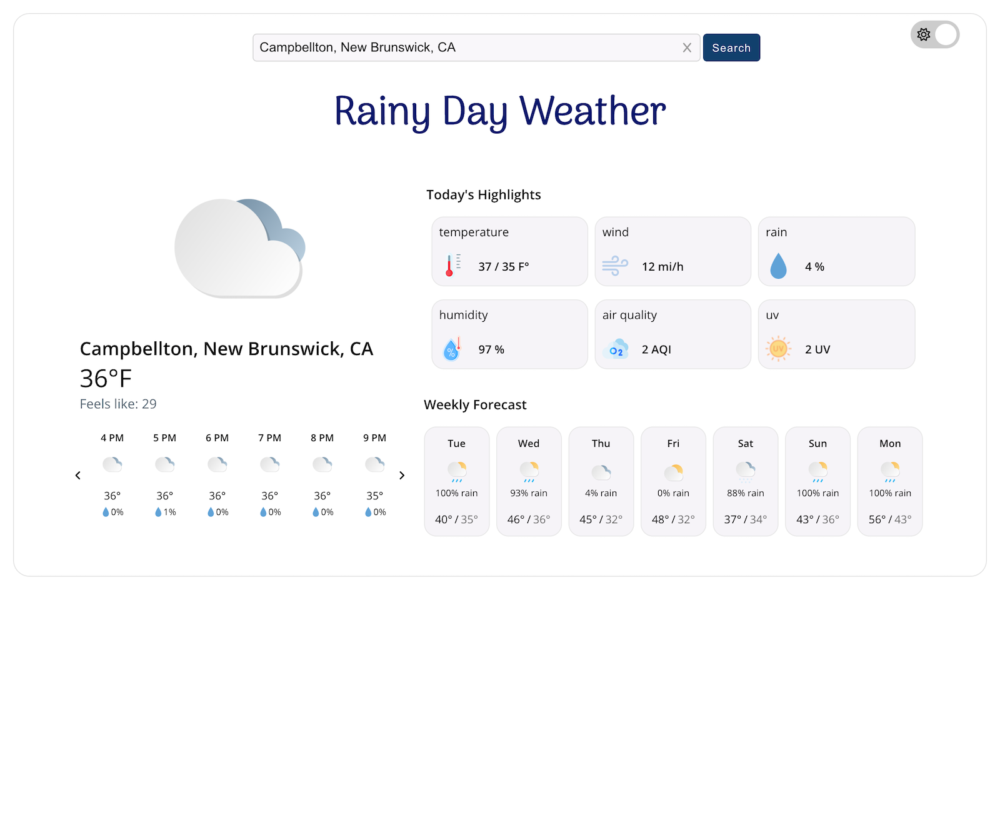

## Description

* Rainy Day Weather a responsive web application that displays weather information for a given location.
* API: Fetch info from OpenWeatherMap
* Status: In Progress

## First Draft Design

# 

**Frontend:** Frontend is built using React, TypeScript, CSS and HTML.

**Backend:** Backend is built using Node.js, Express, Axios

**Weather API:** OpenWeatherMap

**Other Tools:** VSCode, Git, GitHub